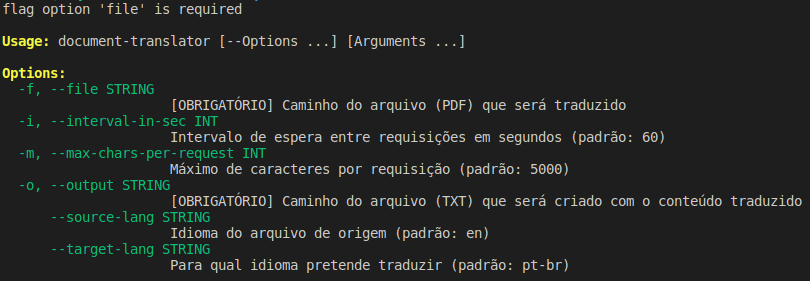

# Sobre

Traduz documentos de uma linguagem para outra.

Atualmente apenas lê arquivo PDF e persiste a tradução em um arquivo TXT.
Está utilizando o Google Translator em sua versão gratuita e sem autenticação, então tem suas limitações (veja abaixo).

# Utilização

## Como biblioteca

Para utilizar esta biblioteca no seu projeto pode seguir o exemplo abaixo.

Utilize o parâmetro `onTranslate` para persistir a tradução em um arquivo, banco de dados, ou qualquer outro lugar mais apropriado para o seu projeto.

```php
use DocumentTranslator\Core\Arguments;
use DocumentTranslator\Library\DocumentTranslator;
use DocumentTranslator\Library\Readers\PDFDocumentReader;
use DocumentTranslator\Library\Translators\GoogleTranslator;
use Exception;

define('INPUT_FILEPATH', './awesome.pdf');
define('OUTPUT_FILEPATH', './awesome.txt');
define('FROM_LANGUAGE', 'en');
define('TO_LANGUAGE', 'pt-br');
define('CHUNK', 5000);
define('INTERVAL', 60);

$fp = fopen(OUTPUT_FILEPATH, 'a');

DocumentTranslator::create(
   new PDFDocumentReader(),
   new GoogleTranslator
)->withFile(PDF_FILEPATH)
->fromLanguage(FROM_LANGUAGE)
->toLanguage(TO_LANGUAGE)
->setChunk(CHUNK)
->setInterval(INTERVAL)
->translate(
   onTranslate: function (string $old, string $new, int $offset) use ($fp) {
         echo sprintf("Processing offset %d...\n", $offset);
         fwrite($fp, $new);
   },
   onSuccess: function (string $amountTranslatedChars) {
         echo sprintf(
            "Processed %d characters.\n",
            $amountTranslatedChars
         );
         exit(0);
   },
   onError: function (Exception $exception) use ($fp) {
         echo 'ERROR! ' . $exception->getMessage();
         fclose($fp);
         exit(1);
   }
);

fclose($fp);
```

## Command Line

Depois de instalada a biblioteca em um projeto, pode executar o `Command Line` utilizando `vendor/bin/document-translator`.
Caso deseja executar o `Command Line` logo após clonar o projeto com o `Git`, ao invés de usar `vendor/bin/document-translator`, utilize `php index.php`.

Este é um script para terminal e o mínimo necessário para utilizar o script é:

```bash
# Traduz do Inglês para Português do Brasil (padrão)
$ ./vendor/bin/document-translator ./storage/arquivo_pdf.pdf ./storage/arquivo_traduzido.txt
```

Para traduzir do Português do Brasil (pt-br) para o Inglês (en):

```bash
$ composer install
$ ./vendor/bin/document-translator ./storage/arquivo_pdf.pdf ./storage/arquivo_traduzido.txt --from=pt-br --to=en
```

Para customizá-lo mais, veja o help exibido ao executar `./vendor/bin/document-translator`:




# Requerimentos

- composer
- PHP 8 ou superior

# Limitações

Entendo que você está interessado nas limitações diárias da API do Google Tradutor quando não há autenticação ou chave de API. Vamos explorar essas limitações:

1. **Limite de caracteres por requisição**:
   - O limite recomendado para cada requisição é de **5.000 caracteres** (pontos de código). Portanto, se você enviar mais do que isso em uma única chamada, poderá enfrentar problemas¹.
   - Além disso, a API é otimizada para traduções menores, e exceder esse limite pode afetar a qualidade das traduções.

2. **Quotas diárias e por minuto**:
   - Por padrão, o número de caracteres que você pode enviar por dia é **ilimitado**. No entanto, é recomendável monitorar o uso diário e ajustar as cotas conforme seu orçamento planejado.
   - As cotas variam dependendo da versão da API:
     - Caracteres enviados para o modelo geral por projeto por minuto: **6.000.000**.
     - Páginas enviadas para tradução de documentos por projeto por minuto: **2.400**¹.

3. **Traduções automáticas**:
   - As traduções feitas usando a API não consideram idiossincrasias ou variações de linguagem específicas de mercados locais. Portanto, as traduções resultantes podem ser monótonas, repetitivas ou imprecisas².

4. **Intervalo entre requisições**:
   - Não há um intervalo específico entre requisições definido pela API quando não há autenticação ou chave de API. No entanto, é uma boa prática evitar fazer muitas requisições em um curto período de tempo para não sobrecarregar o serviço.


# Limitações do da API Google Translator

A API do Google Tradutor possui algumas limitações para uso gratuito. Vamos explorá-las:

1. **Limite de caracteres por requisição**:
   - O limite recomendado para cada requisição é de **5.000 caracteres** (pontos de código). Portanto, se você enviar mais do que isso em uma única chamada, poderá enfrentar problemas¹.
   - Além disso, a API é otimizada para traduções menores, e exceder esse limite pode afetar a qualidade das traduções.

2. **Quotas diárias e por minuto**:
   - A API impõe cotas para o tamanho do conteúdo das requisições e o número de requisições que você pode enviar.
   - Por padrão, o número de caracteres que você pode enviar por dia é ilimitado. No entanto, é recomendável monitorar o uso diário e ajustar as cotas conforme seu orçamento planejado.
   - As cotas variam dependendo da versão da API (v2 ou v3) e do tipo de tradução (geral, transliteração ou romanização). Por exemplo:
     - Caracteres enviados para o modelo geral por projeto por minuto: 6.000.000.
     - Páginas enviadas para tradução de documentos por projeto por minuto: 2.400¹.

3. **Traduções automáticas**:
   - As traduções feitas usando a API não consideram idiossincrasias ou variações de linguagem específicas de mercados locais. Portanto, as traduções resultantes podem ser monótonas, repetitivas ou imprecisas².

4. **Autenticação e chaves de API**:
   - Para usar a API, você precisa ter uma conta no Google Cloud e obter uma chave de API do Tradutor. Essa chave é usada para autenticar solicitações e controlar o uso da API⁴.


# Limitações por conta da não-autenticação e não-uso de chaves de API

A biblioteca **stichoza/google-translate-php** não utiliza autenticação e chaves de API, o que significa que ela não requer credenciais específicas para acessar a API do Google Tradutor. No entanto, essa abordagem tem algumas limitações:

1. **Limite de IP e uso compartilhado**:
   - Como a biblioteca não usa autenticação individual, todas as solicitações de tradução feitas por ela são agrupadas em um único endereço IP.
   - Isso pode levar a limitações impostas pelo Google para compartilhamento de recursos. Se muitos usuários estiverem usando a mesma biblioteca sem autenticação, o limite de uso compartilhado poderá ser atingido mais rapidamente.

2. **Cotas e bloqueios**:
   - O Google Tradutor impõe cotas para o número de caracteres traduzidos por dia e por minuto. Sem autenticação, essas cotas são aplicadas globalmente para todos os usuários que usam o mesmo IP.
   - Se o limite for excedido, você poderá enfrentar bloqueios temporários ou restrições de acesso.

3. **Qualidade das traduções**:
   - A ausência de autenticação significa que a biblioteca não pode usar credenciais específicas do projeto para personalizar as traduções com base no contexto ou nas preferências do usuário.
   - As traduções podem ser mais genéricas e menos precisas em comparação com o uso autenticado da API.

4. **Recomendação**:
   - Se você planeja usar a biblioteca em um ambiente de produção ou para traduções frequentes, é altamente recomendável configurar autenticação e usar uma chave de API do Google Tradutor.
   - Dessa forma, você terá controle individual sobre as cotas, melhor qualidade de tradução e evitará problemas de compartilhamento de IP.